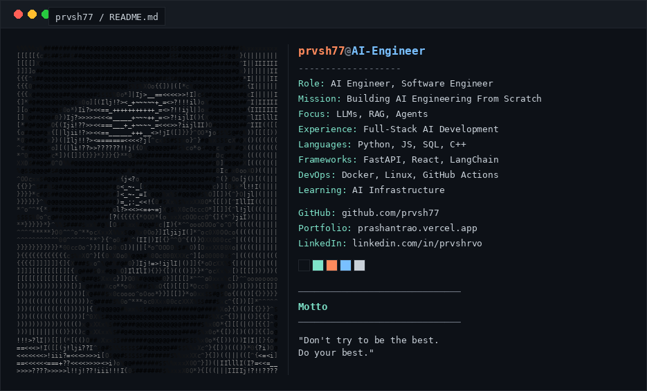

<div align="center">



</div>
<div align="center">

# 👋 Hi, I'm M Prashant Rao

### AI Engineer • Software Engineer • LLM Systems • Agentic AI • Open Source

[](https://git.io/typing-svg)

<br>


</div>

---

<div align="center">

<a href="https://portfolio-six-omega-lh3p4676it.vercel.app/">


</a>

<a href="https://github.com/prvsh77">


</a>

<a href="https://www.linkedin.com/in/prvshrvo">


</a>

<a href="mailto:YOUR_EMAIL@gmail.com">


</a>

</div>

---

# 🚀 Current Mission

I'm building an open-source ecosystem that teaches **AI Engineering from first principles**, helping developers understand how modern AI systems work instead of treating them as black boxes.

Current long-term mission:

- 🤖 AI Engineering From Scratch
- 📚 LLM Engineering From Scratch
- 🔍 RAG Engineering From Scratch
- 🧠 Context Engineering From Scratch
- ⚙️ Agent Engineering From Scratch
- 🚀 AI Infrastructure Engineering

---

# 👨‍💻 About Me

I'm a Computer Science undergraduate passionate about designing **production-ready AI systems**.

Instead of focusing only on model training, I enjoy engineering complete AI applications involving:

- 🤖 Large Language Models (LLMs)
- 📚 Retrieval-Augmented Generation (RAG)
- 🧠 AI Agents
- ⚡ AI Infrastructure
- 🔍 Evaluation Pipelines
- 🌐 Full-Stack AI Applications

I enjoy transforming research ideas into scalable software and contributing to open-source AI projects.

---

# 💡 Philosophy

> **"Don't try to be the best. Do your best."**

I believe great AI systems are built through engineering discipline, continuous learning, and solving real-world problems—not by chasing hype.

---

# 🧠 AI Expertise

<div align="center">

| AI | Backend | Data |
|:---:|:---:|:---:|
| Machine Learning | FastAPI | Pandas |
| Deep Learning | REST APIs | NumPy |
| NLP | Node.js | SQL |
| RAG | PostgreSQL | Data Processing |
| AI Agents | MongoDB | Feature Engineering |
| Prompt Engineering | Docker | Analytics |
| LangChain | GitHub Actions | Visualization |
| LangGraph | CI/CD | Evaluation |

</div>

---

# 🛠️ Tech Stack

## 👨‍💻 Languages

<p align="center">


</p>

---

## 🤖 AI / Machine Learning

<p align="center">


<br>


</p>

---

## 🌐 Web Development

<p align="center">


</p>

---

## ☁️ Cloud • DevOps

<p align="center">


</p>

---

## 🗄️ Databases

<p align="center">


</p>

---

## ⚡ Currently Working With

- Python
- FastAPI
- React
- PostgreSQL
- MongoDB Atlas
- OpenAI APIs
- LangChain
- LangGraph
- Docker
- GitHub Actions

---
# 🚀 Featured Projects

<div align="center">

| Project | Description | Stack |
|---------|-------------|-------|
| 🤖 **AI Code Review Assistant** | Multi-agent AI platform that reviews pull requests, detects bugs, security issues, code smells and provides intelligent suggestions. | React • FastAPI • PostgreSQL • OpenAI |
| 🧠 **TalentScout AI** | AI-powered technical hiring assistant capable of conducting intelligent candidate screening interviews. | Python • LLM • NLP |
| 📦 **FedEx Analytics Dashboard** | Machine learning dashboard for shipment analytics, prediction and business intelligence. | Python • Streamlit • Scikit-learn |
| 🗄️ **Text-to-SQL** | Natural language interface that converts user questions into executable SQL queries. | Python • NLP |
| 📚 **KnowledgeHub AI** | AI-powered document understanding platform using Retrieval-Augmented Generation. | FastAPI • React • MongoDB |
| 🌍 **Portfolio Website** | Modern portfolio showcasing AI engineering projects with interactive UI. | Next.js • TypeScript |

</div>

---

# 🌟 Open Source Journey

I enjoy contributing to open-source projects and building educational resources that help developers understand modern AI systems.

### Current Focus

- 🚀 AI Engineering From Scratch
- 📚 LLM Engineering From Scratch
- 📖 RAG Engineering From Scratch
- 🤖 Agent Engineering From Scratch
- ⚡ AI Infrastructure
- 🌍 Educational Open Source

---

# 🧩 AI Engineering Ecosystem

The long-term vision is to build an ecosystem of open-source repositories covering every major area of AI Engineering.

```text
AI Engineering From Scratch

│

├── LLM Engineering From Scratch

├── RAG Engineering From Scratch

├── Prompt Engineering From Scratch

├── Context Engineering From Scratch

├── Agent Engineering From Scratch

├── Loop Engineering From Scratch

├── Evaluation Engineering From Scratch

├── Fine-Tuning Engineering From Scratch

├── Inference Engineering From Scratch

├── AI Infrastructure Engineering From Scratch

├── AI Security Engineering From Scratch

└── Multimodal Engineering From Scratch
```

---

# 📊 GitHub Analytics

<div align="center">


</div>

---

# 🔥 GitHub Streak

<div align="center">


</div>

---

# 📈 Contribution Graph

<div align="center">


</div>

---

# 🏆 GitHub Achievements

<div align="center">


</div>

---

# 📚 Development Workflow

```text
          💡 IDEA
             │
             ▼
      📖 RESEARCH
             │
             ▼
      🏗 SYSTEM DESIGN
             │
             ▼
      ⚙ IMPLEMENTATION
             │
             ▼
      🤖 AI INTEGRATION
             │
             ▼
      🧪 EVALUATION
             │
             ▼
      🚀 DEPLOYMENT
             │
             ▼
     📈 ITERATION & SCALE
```

---

# 📈 GitHub Summary

<div align="center">


</div>

---

# 📖 Currently Reading

- Attention Is All You Need
- ReAct
- Toolformer
- Self-RAG
- DeepSeek-V3 Technical Report
- OpenAI GPT Research
- Anthropic Constitutional AI
- SWE-Agent

---

# ⚡ Current Build Queue

✅ AI Code Review Assistant

✅ Portfolio Website

🚀 AI Engineering From Scratch

🚀 LLM Engineering From Scratch

🚀 KnowledgeHub AI

🚀 Agentic AI Projects

---
# 🗺️ AI Engineering Roadmap

> My goal is to become a world-class AI Engineer by mastering the complete AI engineering stack—from model fundamentals to production infrastructure.

```text
████████████████████████████████████████████████

✅ Python

✅ Data Structures & Algorithms

✅ SQL

✅ Machine Learning

✅ Deep Learning

✅ NLP

✅ Computer Vision

✅ Data Engineering

✅ REST APIs

✅ Docker

━━━━━━━━━━━━━━━━━━━━━━━━━━━━━━━━━━━━━━━━━━━━━━━

🚀 LLM Engineering

🚀 RAG Engineering

🚀 Prompt Engineering

🚀 Context Engineering

🚀 AI Agents

🚀 LangChain

🚀 LangGraph

🚀 MCP

━━━━━━━━━━━━━━━━━━━━━━━━━━━━━━━━━━━━━━━━━━━━━━━

🎯 Fine-Tuning

🎯 AI Infrastructure

🎯 Inference Optimization

🎯 AI Evaluation

🎯 Distributed AI Systems

🎯 AI Security

🎯 Multimodal AI

━━━━━━━━━━━━━━━━━━━━━━━━━━━━━━━━━━━━━━━━━━━━━━━

🌍 AI Engineering From Scratch Ecosystem

████████████████████████████████████████████████
```

---

# 🎯 2026 Goals

- 🚀 Publish **AI Engineering From Scratch**
- 📚 Build the **LLM Engineering From Scratch** curriculum
- 📖 Build the **RAG Engineering From Scratch** curriculum
- 🤖 Ship 10+ production AI projects
- 🌍 Become an active open-source AI contributor
- ⭐ Reach 1,000+ GitHub stars across repositories
- 📝 Write technical articles on AI Engineering
- 💼 Start my career as an AI Engineer

---

# 🌍 Let's Build AI Together

I'm always interested in collaborating on projects involving:

- 🤖 AI Engineering
- 🧠 LLM Applications
- 📚 Retrieval-Augmented Generation (RAG)
- ⚙️ AI Agents
- 🌐 Full-Stack AI Applications
- 📖 Open Source
- 🔬 AI Research & Engineering

---

# 📬 Connect With Me

<div align="center">

<a href="https://portfolio-six-omega-lh3p4676it.vercel.app/">

</a>

<a href="https://github.com/prvsh77">

</a>

<a href="https://www.linkedin.com/in/prvshrvo">

</a>

<a href="mailto:YOUR_EMAIL@gmail.com">

</a>

</div>

---

# 💬 Favorite Quote

<div align="center">

## "Don't try to be the best. Do your best."

*"Consistency compounds into mastery."*

</div>

---

# ❤️ Support My Work

If you find my work useful,

⭐ Star the repositories

🍴 Fork them

📝 Open an issue

💡 Share suggestions

🤝 Let's collaborate

Every contribution helps improve the AI engineering ecosystem.

---

# 🚀 Thanks for Visiting

<div align="center">

### Building reliable AI systems, one project at a time.

⭐ **Happy Coding!** ⭐


</div>
